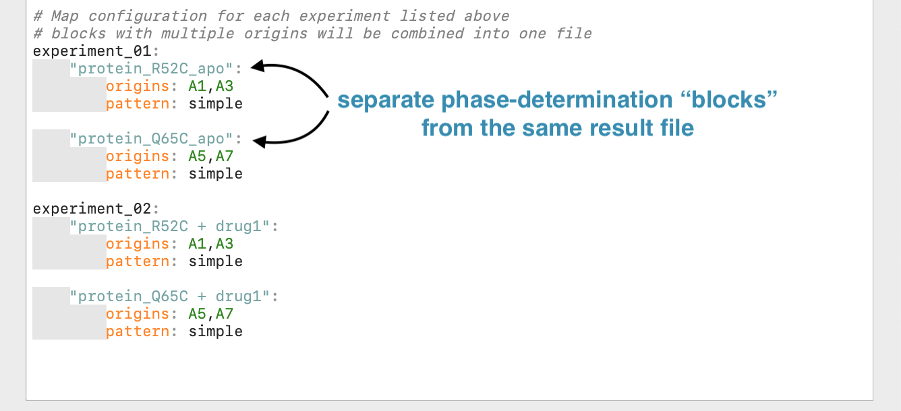
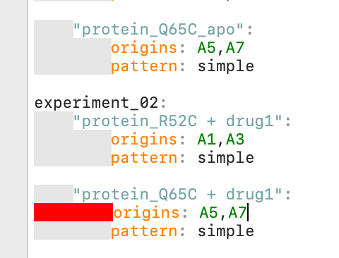
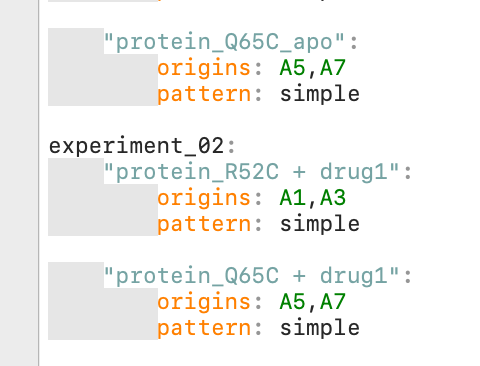
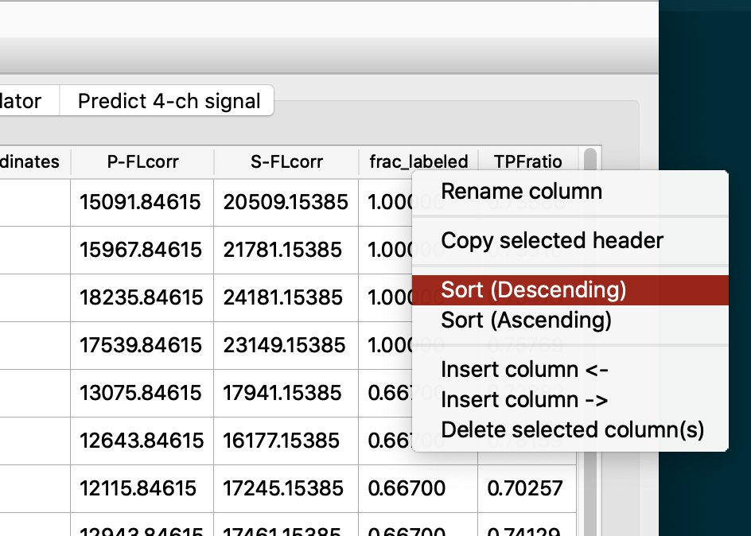
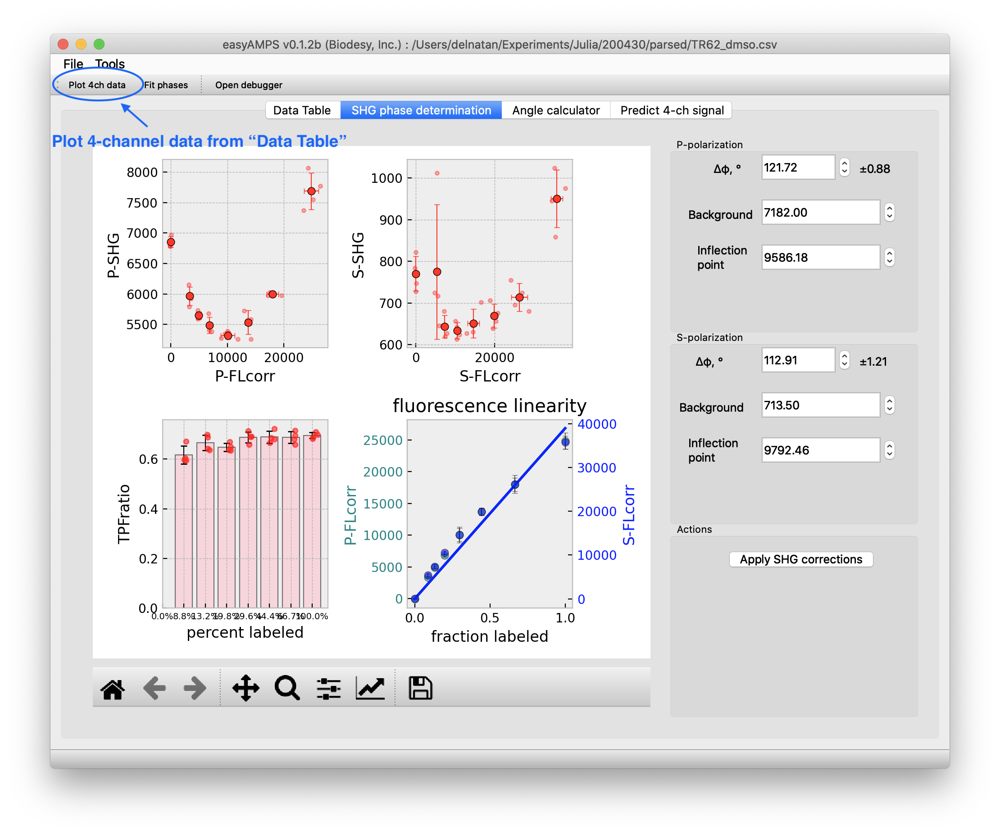
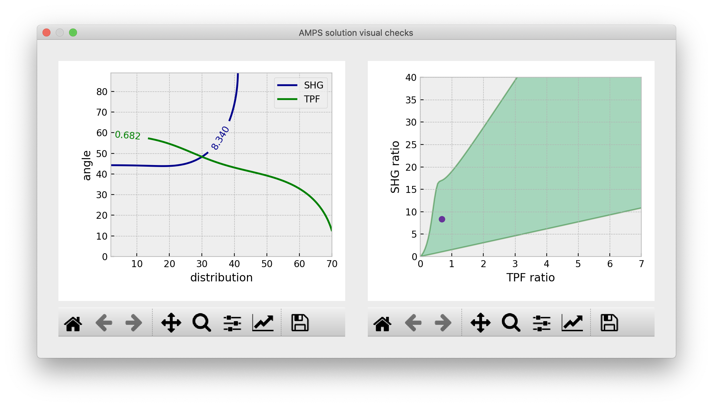

# easyAMPS guide & documentation

**Table of Contents**

[TOC]

# Introduction

easyAMPS was written to help process 4-channel data from phase-determination, SHG intensity correction, and angular mapping of single-site labeled protein using a Gaussian model. The algorithms used in this software is taken from ([Clancy et al. 2019](#References))

Before you can use easyAMPS to analyze your data, you'll need to parse and convert the output results Excel files into a standardized CSV format for the program. You can do this using the [AMPS script editor](#AMPS-script-editor).

## Parsing raw data

### AMPS script editor
To access this feature, go to `Tools > AMPS script editor` from the top menu toolbar.

To help organize each AMPS experiments done on a 384-well plate, the script editor uses plain text to specify how the files should be processed. The script configuration is composed of separate blocks delineated by very specific spacing. **Spaces highlighted in `gray` is very important**. There are also very specific words that **are required and can only appear ONCE** in the entire file. These keywords are: `directories, experiments, patterns, origin, pattern, and exclude`. The keywords in blue specify a section easyAMPS where it will look for specific script parameters, which is in orange. Here's an overview of these blocks and keywords:

Here's a detailed explanation for each section of the script:
`directories` section
`input` is the path to the folder where result files reside.
`output` is the path where you want the generated CSV files to be saved. If the folder does not exist, easyAMPS will create it as a new folder.

*Note: this screenshot shows an example in MacOS. In Windows OS, you'll need to use the appropriate format for specifying folder paths (e.g. `C:\Users\BiodesyUser\Experiments`)*

`experiments` section

`blank` is the bilayer blank result file. This is used to subtract background fluorescence from the assay plate. The line below this blank file specifies an experimental result file (e.g. for baseline, injection, or imidazole wash, etc). You can name it whatever you want as long as it has **no spaces or special characters** (!@#$%^&*()~/\|`)

`protein_deposition` is an example of a valid name for one of the experiment

`post_injection` is yet another example of a valid name for the second experiment.

`patterns` section

`simple:` `!!python/list` is a matrix designating the dilution series pattern of the labeled:unlabeled protein mixture. 1 corresponds to fully labeled, and the last number (in this case, it's 8) in the series corresponds to 100% unlabeled.

Once these sections are filled with the appropriate parameters, then we can move on to the last section. Which is using these parameters to properly annotate our experiments.

Here each experiment named under the `experiments` section will be annotated using the pre-defined dilution pattern specified under the `patterns` section, you can specify multiple patterns as long as you give them unique names. The first indent below the experiment name define one particular dilution series within the result file **this will be the name of your output CSV file**. The `origins` specify the top-left well of the dilution series. Repeating pattern for the same experiment can be combined by specifying multiple origins, separated by a comma. A valid well name will be highlighted in green. The parameter  `pattern` refers to the dilution series pattern that has been defined above.

Correct spacing within the script editor will be highlighted in gray. You can use tab to properly indent the blocks, but you'll have to replace them eventually with spaces. Use the button <kbd>Convert tabs</kbd> to turn these red blocks into spaces. **Tabs are not allowed in the script**. Please double-check for parameters that appear out of alignment because they contain extra spaces. See examples below:

| Tabs are not allowed ❌                                       | Alignment matters ❌                                          | correct spacing ✅                                            |
| ------------------------------------------------------------ | ------------------------------------------------------------ | ------------------------------------------------------------ |
|  |  |  |

Keep an eye out for extra spaces, they can be spotted because they're out of alignment with the gray blocks.

You can save the script for later use or for templates for future/other experiments. Once you're ready, you can run the script. Once the process is done, you should see some messages being printed out in the message box below. Your parsed CSV files for each experiment should be saved in the folder specified in the `output` folder.

## Phase determination and correction

Open the CSV file that was parsed from running the script above. You can use the keyboard shortcut <kbd>Ctrl</kbd> + <kbd>o</kbd> or go to `File > Open CSV file ...` from the menu. You'll see that the 'Data Table' tab is now populated with the CSV. If you took multiple timepoints, you can do some filtering based on the "Read Num" column (the original file contains the name "Read #", but this has been converted internally by the program into "Read Num" to allow Python to parse the file). 

To filter the data, simply right-click anywhere on the table and select `Set filter` from the menu.

Let's say we want to determine phase differences at Read Num of 12. Set the column `Read Num` on the left drop-down box, and use the condition `==`, with 12 as the value. We need to check the box `as string` because this column contains not only numbers. The column contains the word "Baseline" which is a string. Click Add to add the filter to the current data set. Any time you're dealing with data entries that are not numbers, you need to check the box.

You should see the results live on the data table. You can add/remove additional filters using this interface.

By right-clicking on each column header, you can also sort the data table based on that column.

Usually I do this on the `frac_labeled` column to group the dilution series into organized blocks.

**For plotting and phase determination, these columns need to be present in the "Data Table"**: `P-SHG`, `S-SHG`,`P-FLcorr`, `S-FLcorr`,`frac_labeled`

To plot the data click on the `Plot 4ch data` on the top left corner of the window. This will populate the 2x2 grid of plot in the tab `Phase Determination`

If you see an outlier and you'd like to exclude them from plotting and fitting, go back to the "Data Table" tab and right click on the data point, choose "Exclude selected row(s)". The row will be grayed out indicating that this data point will be ignored in the plotting.  Clicking on "Fit Phases" will fit a quadratic model for the top two plots in the grid, and the parameters on the right are automatically filled in with the fitted values. 

Clicking on `Apply SHG corrections` will correct the SHG intensities with whatever parameter filled in the boxes on the right hand panel. These will create three new columns in "Data Table" tab: `P-SHGcorr`, `S-SHGcorr`, `SHGratio`. 

At any point, you can save the data that is current in the "Data Table" tab into a new CSV file by going to `File > Save CSV file ...` from the top menu.

## Angular parameters

The probe (Gaussian) distribution parameters are determined from two quantities: `TPFratio` and `SHGratio`, do calculate the angles. Select quantities from these two columns (by using click+shift and/or ctrl+shift combination just like in Excel), and copy these two columns from "Data Table", copy them to the system clipboard via <kbd>Ctrl</kbd>+<kbd>c</kbd> or in MacOS <kbd>Cmd</kbd>+<kbd>c</kbd>.  Go to the "Angle calculator" tab and paste these values.

Clicking on <kbd>Compute angles</kbd> button will populate the `angle` and `distribution` column IF there is a solution to be found. 

You can also input any number you wish for in the columns `TPFratio` and `SHGratio` and try to compute angles. This way you can use easyAMPS as a convenient angle calculator.

To check how the solution was found, you can click and select any data from the table and click on `check (selected) solutions`. This will give a plot like this:

In the plot on the left, this is how the algorithm finds a unique solution for a given pair of SHG and TPF ratios. The intersection of the two lines indicate a unique solution for a particular angular distribution. When the curves never intersect, a solution can't be found and may indicate some non-idealities about the current data set being evaluated. More explanation of this plot is given below.

## AMPS solution boundaries

Using the Gaussian distribution to describe probe orientation on the surface allows a unique solution to be found in the same way that two equations with two unknowns are solved. The unique solution is found when the SHG and TPF ratios intersect as shown in the contour line on the plot below (purple dot, left and right plots). For example this is an example showing a solution for SHG ratio at 15 and TPF ratio of 3:

Shaded in green in the plot on the right are possible values of SHG and TPF ratios that have a unique solution for the Gaussian distribution model. Each solution boundary comes from various extreme situations of the probe distributions:

1) the probe distribution is very narrow, with distribution that extremely narrow, approaching zero-width (left plot, left side of plot axis, green color)

2) the probe distribution lies very flat, parallel to the bilayer surface (left plot, top side of axis, teal color)

3) the probe distribution points perfectly perpendicular or normal to the bilayer surface (left plot, bottom of the axis, slate blue)

4) when probe distribution is very broad, indistinguishable from completely disordered distribution, pointing in all directions. In this case, the ratio converges to a characteristic SHG ratio of 16.9 and TPF ratio of 0.692. In general as the distribution broadens, the solutions will get closer to the red-point (right plot)

## Predicting signal changes

*work in progress ...*

# References

Clancy, Bason, Ben Moree, and Joshua Salafsky. "Angular Mapping of Protein Structure Using Nonlinear Optical Measurements." *Biophysical journal* 117.3 (2019): 500-508. https://www.sciencedirect.com/science/article/pii/S0006349519305624

